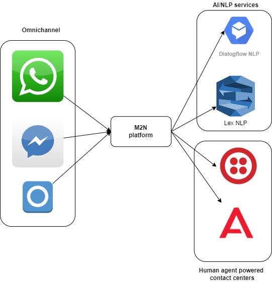
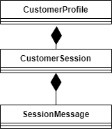

# Architecture

This repository describes different aspects of m2n platform architecture, ranging from high level motivation & architecture to low level technical details.

## Vision

M2N is customer contact (aka customer engagement) platform. It enables customers to talk to businesses via different digital channels (both text & voice based).

Basic use case we do support is as follows:

* customer is contacting business via particular digital channel(e.g. signal, whatsapp, telephony)
* customer is directed to automated chat-bot/voice-bot AI solution that can handle rudimentary requests
* if AI solution concludes it cannot help further more or if customer asks explicitly platform forwards the session to human agent (so called human transfer/handover).

### Why M2N?

 

M-to-N cardinality describes best the basic goal M2N platform does follow. We don’t want to be married to any particular input channel, NLP technology, etc. Hence we do:

* support multiple channels in plug-gable way. M2N will be designed as omnichannel solution.
* support multiple NLP engines, again as interchangeable plugins. 
* support multiple human transport providers/backends

**DISCLAIMER**: This is fun / POC project. The main purpose of this project is to have a fun and explore new technologies. It is not meant as fully blown and production ready platform.

## Technical architecture

Without too much formalism and heavy structure technical architecture can be described in following bullet points:

* Golang will be used as main programming language
* Platform will be split into small manageable  micro-services
* [DAPR](https://dapr.io/) service mesh will be used as micro-service orchestration platform
* MongoDB will be used as database storage
* For state full components actor design pattern will be used (relying on existing DAPR implementation)
* To bridge the differences between formats used by different messaging channels, NLP & human handover services common format will be devised. This format will provide common abstraction and enable transparent plugin based architecture.
* M2N will be designed as multi-tenant architecture. Tenant typically represents separate business entity or organization unit within bigger business entity. Each tenant has separate configuration of both inbound channels and backend services (NLP, contat centers).
* Initial implementation will focus on text based channels.
* For internal pub/sub communication Redis will be used. Where message persistence and strict message ordering is will be needed AWS SQS FIFO queues will be employed.

### Data model

Described below are the core entities M2N platform works with:

 

**Customer profile** gather all customer data gathered (in ideal case) across all channels customer interacts over. If it is not possible to identify and merge different interactions coming from same customer but different channels into single CustomerProfile instance it is still possible that multiple customer profiles will be created. Separate microservice will be created responsible for checking whether incoming customer contact/session can be merged under existin customer profile.

**Customer session** represents short term (eg. 20  minutes) chat/voice session of customer. Should the customer come back later (e.g. one day later) separate session will be created under customer profile.

**Session message** represents inbound (message coming from customer) or outbound message (message coming from chat-bot/voice-bot/human-agent) within particular customer session.

### Microservices split-up 

Following microservices will be created:
* Channel webhooks
  * receives traffic from external platforms (e.g. whatsapp)
  * transforms channel specific payloads into common format
  * puts into messaging queue with strict message ordering (aka inbound message queue).
* Customer identification
  * picks up messages from inbound message queue and tries to determine whether message does belong to existin customer profile or new profile should be created
  * if necessary creates new profile
  * calls session service
* Session services
  * determines whether incoming message belongs to existing session or new session must be created
  * creates new session (if needed) and forwards message for routing
* Message router
  * determines whether message should be sent to NLP or human agent system. Based on configuration and session data routes the message accordingly
* NLP plugins
  * service adapters integration particular NLP engine
* Human handover plugins
  * service adapters integrating particular contact center engine

**TBD**: create diagrams showing typical interactions of listed microservices.